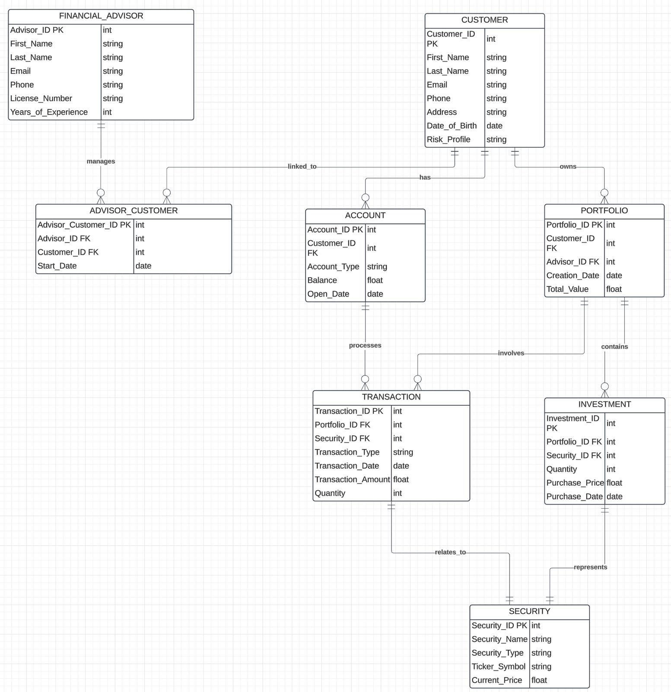

# Wells Fargo Task 2 - Counselor Application

## Project Overview

This project is part of Forage's Wells Fargo software engineering program. The objective is to implement a data model within a Spring Boot application, using JPA for data persistence and H2 as an in-memory database.

## Entity-Relationship Diagram (ERD)

Below is the ERD diagram that illustrates the relationships between different entities in the application:



## Objectives

1. **Implement Data Model**: Create entity classes for the data model, including `Advisor`, `Client`, `Customer`, `Account`, and `FinancialAdvisor`.
2. **Configure Spring Boot Application**: Set up the application with Spring Boot, JPA, and H2 database.
3. **Create REST Endpoints**: Implement a simple REST controller to verify the application is running.

## Solutions

- **Entity Classes**: Each entity class is annotated with `@Entity` and includes fields with appropriate JPA annotations (`@Id`, `@GeneratedValue`, `@Column`, etc.). Relationships between entities are defined using annotations like `@ManyToOne`.

- **Spring Boot Configuration**: The `pom.xml` includes dependencies for Spring Boot, JPA, and H2. The `application.properties` file is configured for an in-memory H2 database.

- **REST Controller**: A `HomeController` is created to map the root URL (`/`) to a welcome message, ensuring the application is accessible.

## Detailed Explanation

- **Advisor and Client Entities**: These entities represent the advisors and clients in the system. They include basic information such as names, contact details, and are linked to other entities through relationships.

- **Customer and Account Entities**: The `Customer` entity includes personal details and is linked to `Account` entities, which represent financial accounts with details like account type and balance.

- **FinancialAdvisor Entity**: This entity includes professional details of financial advisors, such as license numbers and years of experience.

- **Data Persistence**: The application uses JPA to map these entities to tables in the H2 database, allowing for CRUD operations.

## Running the Project

### Prerequisites

- **Java 19**: Ensure Java 19 is installed and configured on your system.
- **Maven**: Ensure Maven is installed for building and running the project.

### Steps to Run

1. **Clone the Repository**: Clone the project repository to your local machine.

   ```bash
   git clone <repository-url>
   cd <repository-directory>
   ```

2. **Build the Project**: Use Maven to build the project.

   ```bash
   mvn clean install
   ```

3. **Run the Application**: Start the Spring Boot application.

   ```bash
   mvn spring-boot:run
   ```

4. **Access the Application**: Open a web browser and go to `http://localhost:8080`. You should see the welcome message: "Welcome to the Counselor Application!"

5. **Access the H2 Console**: To view the database, go to `http://localhost:8080/h2-console`. Use the following credentials:
   - **JDBC URL**: `jdbc:h2:mem:testdb`
   - **Username**: `sa`
   - **Password**: `password`

## Conclusion

This project demonstrates the implementation of a data model using Spring Boot and JPA, with an in-memory H2 database for persistence. The application is configured to run locally, providing a simple REST endpoint and access to the H2 console for database inspection.

Feel free to explore the codebase and modify it to suit your needs. If you have any questions or encounter issues, please refer to the Spring documentation or reach out for assistance.
